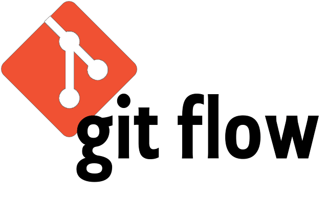

<a name="readme-top"></a>
<div align="center">
  
  <br/>

  <h3><b>Try Gitflow</b></h3>

</div>

<!-- TABLE OF CONTENTS -->

# <b>Table of Contents 📋

- [📖 About the Project](#about-project)
  - [🛠 Built With](#built-with)
    - [Key Features](#key-features)
- [💻 Getting Started](#getting-started)
  - [Setup](#setup)
  - [Prerequisites](#prerequisites)
  - [Install](#install)
  - [Usage](#usage)
  - [Deployment](#deployment)
- [👥 Authors](#authors)
- [👥 Attribution](#attribution)
- [🔭 Future Features](#future-features)
- [🤝 Contributing](#contributing)
- [⭐️ Show your support](#support)
- [🙏 Acknowledgements](#acknowledgements)
- [❓ FAQ (OPTIONAL)](#faq)
- [📝 License](#license)
</b>
<hr><hr>
<!-- PROJECT DESCRIPTION -->

# <b>Try Gitflow   📖</b><a name="about-project"></a>

**Try Gitflow** Is a minimal repo project implemented for the purposes of learning gitflow
<br><hr>

<!-- BUILT WITH -->
## <b>Built With 🛠</b><a name="built-with"></a><br>

<!-- TECH STACK -->
### <b>Tech Stack 🗜️</b><a name="tech-stack"></a>

<details>
  <summary>Gitflow</summary>
  <ul>
    <li><a href="https://datasift.github.io/gitflow/IntroducingGitFlow.html">Gitflow</a></li><br>
  
  </ul>
</details>
<!-- 
<details>
  <summary>Javascript runtime environment</summary>
  <ul>
    <li><a href="https://nodejs.org">Node JS</a> as a javascript runtime machine [git], a free and open source distributed version control system</li>
  </ul>
</details>-->

<!-- <details>
  <summary>Deployment</summary>
  <ul>
    <li><a href="#deployment">GitHub Pages</a></li>
  </ul>
</details>  -->

<br><hr>

<!-- KEY FEATURES -->
### <b>Key Features 🏷️</b> <a name="key-features"></a>

- **gitflow**
- **main branch**
- **dev branch**
- **feature braches**


<p align="right">(<a href="#readme-top">back to top</a>)</p>
<br><hr>

<!-- LIVE DEMO -->
<!-- ## <b>Live Demo 🚀</b><a name="live-demo"></a>

This project is hosted on [GitHub pages](#deployment)Live application can be viewed [here](https://). -->

<p align="right">(<a href="#readme-top">back to top</a>)</p>
<hr>

<!-- GET STARTED -->
## <b>Getting Started 💻</b><a name="getting-started"></a>

To get a local copy up and running, follow these steps.

<!-- PREREQUISITIES -->
### <b>Prerequisites 🧱</b><a name="prerequisites"></a>

In order to run this project you need:

- A Github account
- An IDE e.g [Visual studio code](https://code.visualstudio.com/).
- [A terminal](https://code.visualstudio.com/docs/terminal/basics).

<br><hr>

<!-- SETUP -->
### <b>Setup ⚙️</b><a name="setup"></a>

Clone this repository to your desired folder:<br>
```sh
  cd my-folder
  git clone https://github.com/RileyManda/try-git-flow

  ```
  - Navigate to the folder
```
cd try-git-flow 
```
- Checkout the branch
```
git checkout dev
```

- Feature branches
```
git switch add-quotes
```
<br><hr>

<!-- INSTALL -->
### <b>Install 🏗️</b><a name="install"></a>

Install all dependencies:
All the dependencies are available in package.json and can be installed locally by running:

There are no instalations or dependencies required to use this  project.
<br><hr>

<!-- USAGE -->
### <b>Usage 📂</b><a name="usage"></a>

No execution is required to for this project.

<!-- TESTS -->
<!-- <br><hr>
### <b>Run tests 🧪</b><a name="run-tests"></a>

How should it be tested? 
To run tests, run the following command:

```sh
    npm run build   npm start
```
- CSS linter errors run:

```
npx stylelint "**/*.{css,scss}" --fix
```

- JavaScript linter errors run:

```
npx eslint . --fix
```

<br><hr> -->

<!-- DEPLOYEMENT -->
### <b>Deployment</b> <a name="deployment"></a>

This project was deployed using GitHub Pages. For more information about how to use GitHub pages [read here](https://www.w3schools.com/git/git_remote_pages.asp?remote=github) 🤩. If you want to watch a video about how to use GitHub pages instead of reading [click here](https://www.youtube.com/watch?v=QyFcl_Fba-k&t=251s) ☺️.


<p align="right">(<a href="#readme-top">back to top</a>)</p>

<br><hr>

<!-- AUTHORS -->
## 👥 Authors <a name="authors"></a>

👤 **Riley Manda**

- GitHub: [@RileyManda](https://github.com/RileyManda)
- Twitter: [@rilecodez](https://twitter.com/rilecodez)
- LinkedIn: [rileymanda](https://www.linkedin.com/in/rileymanda/)

<p align="right">(<a href="#readme-top">back to top</a>)</p>

<br><hr>

<!-- FUTURE FEATURES -->
## <b>Future Features 🔭</b><a name="future-features"></a>

- [ ] ** “”**
- [ ] **””**

<p align="right">(<a href="#readme-top">back to top</a>)</p>

<br><hr>

<!-- ATTRIBUTION -->
## 👥 Attribution <a name="attribution"></a>
- ProjectIcon: [Svgrepo](https://www.svgrepo.com/)
<!-- CONTRIBUTING -->

## <b>Contributing 🤝</b><a name="contributing"></a>

If you have suggestions 📝, ideas 🤔, or bug reports 🐛, please feel free to open an [issue](https://github.com/RileyManda/awesome-/issues) on GitHub.
Remember, every contribution, no matter how big or small, makes a difference.

<p align="right">(<a href="#readme-top">back to top</a>)</p>

<br><hr>


<!-- SUPPORT -->
## <b>Show your support 🌟</b><a name="support"></a>


 - <b>Star the project ⭐️</b>: Show your appreciation by starring this GitHub repository. It helps increase visibility and lets others know that the project is well-received.

 - <b>Fork the project 🍴 🎣</b>: If you're interested in making improvements or adding new features, feel free to fork the project. You can work on your own version and even submit pull requests to suggest changes.

 - <b>Share with others 🗺️</b>: Spread the word about this project. Share it on social media, mention it in relevant forums or communities, or recommend it to colleagues and friends who might find it useful.

<p align="right">(<a href="#readme-top">back to top</a>)</p>

<br><hr>

<!-- ACKNOWLEDGEMENTS -->
## <b>Acknowledgments 🙏</b><a name="acknowledgements"></a>

I would like to express my sincere gratitude to [Microverse](https://github.com/microverseinc), the dedicated reviewers, and collaborators. Your unwavering support, feedback, and collaborative efforts have played an immense role in making this journey a resounding success. I am truly grateful for your contributions and for being an integral part of my achievements. Thank you for your continued support.

<p align="right">(<a href="#readme-top">back to top</a>)</p>

<br><hr>

<!-- FAQ (optional) -->
## <b>FAQ ❓</b><a name="faq"></a>

- **Question_1**
  Do I have to use the vs code specifically?
  - Answer_1
    No,you can use any editor of your choice. <br>
- **Question_2**
  Where can I learn more abot gitflow?
  - Answer_2
   You can read and learn more about gitflow [here](https://datasift.github.io/gitflow/IntroducingGitFlow.html): 

<p align="right">(<a href="#readme-top">back to top</a>)</p>

<!-- LICENCE -->
## <b>License 📝</b><a name="license"></a>

This project is [MIT](./LICENSE) licensed.

_NOTE: we recommend using the [MIT license](https://choosealicense.com/licenses/mit/) - you can set it up quickly by [using templates available on GitHub](https://docs.github.com/en/communities/setting-up-your-project-for-healthy-contributions/adding-a-license-to-a-repository). You can also use [any other license](https://choosealicense.com/licenses/) if you wish._

<p align="right">(<a href="#readme-top">back to top</a>)</p>
